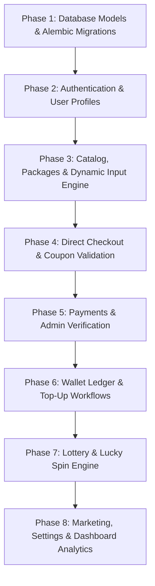
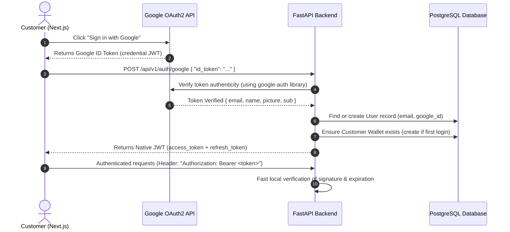

# Digital Products & Services Platform — Full API Development Plan

Based on the specification defined in [`boostghor_like_platform_srs.md`](./boostghor_like_platform_srs.md), this document provides the complete, authoritative development blueprint for the backend API.

---

## Table of Contents

1. [System Overview & Core Business Flow](#1-system-overview--core-business-flow)
2. [Module-by-Module API Specification & Access Control](#2-module-by-module-api-specification--access-control)
   - [Module 1: Authentication & User Management](#module-1-authentication--user-management)
   - [Module 2: Category Management](#module-2-category-management)
   - [Module 3: Product Management & Catalog](#module-3-product-management--catalog)
   - [Module 4: Dynamic Product Input Fields](#module-4-dynamic-product-input-fields)
   - [Module 5: Package Management](#module-5-package-management)
   - [Module 6: Direct Checkout & Order Management](#module-6-direct-checkout--order-management)
   - [Module 7: Coupon Management](#module-7-coupon-management)
   - [Module 8: Payment Method Management](#module-8-payment-method-management)
   - [Module 9: Custom Payment & Verification Flow](#module-9-custom-payment--verification-flow)
   - [Module 10: Customer Wallet & Top-Up System](#module-10-customer-wallet--top-up-system)
   - [Module 11: Lottery & Lucky Spin System](#module-11-lottery--lucky-spin-system)
   - [Module 12: Marketing (Banners & Popups)](#module-12-marketing-banners--popups)
   - [Module 13: Site Settings & Media Uploads](#module-13-site-settings--media-uploads)
   - [Module 14: Admin Dashboard Metrics](#module-14-admin-dashboard-metrics)
3. [Step-by-Step API Development Plan](#3-step-by-step-api-development-plan)
4. [Test Suite Plan](#4-test-suite-plan)
5. [Authentication Architecture Analysis: Clerk vs. Custom Google Auth](#5-authentication-architecture-analysis-clerk-vs-custom-google-auth)

---

# 1. System Overview & Core Business Flow

The platform operates on a direct, streamlined e-commerce model designed specifically for digital goods and services (e.g. streaming subscriptions, gaming top-ups, digital keys, software licenses):

```text
Catalog Browsing
       ↓
Select Package
       ↓
Fill Dynamic Inputs (e.g., Player ID, Account Email)
       ↓
Direct Checkout (Preview & Apply Coupon)
       ↓
Choose Payment Mode (Manual bKash/Nagad/Rocket OR Wallet Balance)
       ↓
Order Created (Status: PAYMENT_PENDING or PAID)
       ↓
Payment Verification (Admin reviews transaction ID)
       ↓
Order Fulfillment (Delivery of digital credentials/service)
```

> **Key Architectural Principle**: The client is never trusted for calculations. All package prices, coupon discounts, wallet balances, and lottery prizes are calculated and validated exclusively on the server side.

---

# 2. Module-by-Module API Specification & Access Control

### Access Control Classifications
- 🟢 **OPEN (Public)**: Unauthenticated public access.
- 🟡 **CLIENT AUTH ONLY**: Authenticated customer token required (`role == "customer"` or `"admin"`).
- 🔴 **ADMIN AUTH ONLY**: Administrative privileges required (`role == "admin"`).

---

### Module 1: Authentication & User Management

Handles customer Google/Clerk synchronization, admin credential authentication, profile management, and user governance.

| Method | Endpoint | Access Control | Description | Request Body / Params | Response |
| :--- | :--- | :--- | :--- | :--- | :--- |
| `POST` | `/api/v1/auth/sync` | 🟡 Client Auth | Synchronizes/creates user profile on first login | `{ "clerk_id": "user_xxx", "email": "user@example.com", "name": "Atik", "image": "https://..." }` | Standard User Profile |
| `POST` | `/api/v1/auth/google` | 🟢 Open | Direct Google OAuth2 login & token issuance | `{ "id_token": "google_credential_jwt" }` | `{ "access_token": "...", "refresh_token": "...", "user": {...} }` |
| `POST` | `/api/v1/auth/admin/login` | 🟢 Open | Admin credential login (email + password) | `{ "email": "admin@example.com", "password": "secure_password" }` | `{ "access_token": "...", "refresh_token": "..." }` |
| `POST` | `/api/v1/auth/refresh` | 🟢 Open | Issues new access token from refresh token | `{ "refresh_token": "..." }` | `{ "access_token": "..." }` |
| `GET` | `/api/v1/users/me` | 🟡 Client Auth | Retrieves current authenticated customer profile & wallet summary | None | User profile object with wallet snapshot |
| `PATCH` | `/api/v1/users/me` | 🟡 Client Auth | Updates customer personal profile details | `{ "name": "Atik Mahmud", "phone": "017XXXXXXXX" }` | Updated User Profile |
| `GET` | `/api/v1/admin/users` | 🔴 Admin Auth | Paginated list of users with search and filters | Query: `page=1`, `limit=20`, `search=atik`, `is_active=true` | `PaginatedResponse[User]` |
| `GET` | `/api/v1/admin/users/{id}` | 🔴 Admin Auth | Full user 360-view (order count, wallet, top-up history) | Path: `id` | Detailed user profile with statistics |
| `PATCH` | `/api/v1/admin/users/{id}/status` | 🔴 Admin Auth | Suspends, bans, or reactivates customer account | `{ "is_active": false }` | Updated User Profile |

---

### Module 2: Category Management

Manages catalog taxonomy and navigation.

| Method | Endpoint | Access Control | Description | Request Body / Params | Response |
| :--- | :--- | :--- | :--- | :--- | :--- |
| `GET` | `/api/v1/categories` | 🟢 Open | Lists all active categories for customer browsing | Query: `is_active=true` | `List[CategoryResponse]` |
| `GET` | `/api/v1/categories/{slug}` | 🟢 Open | Gets single category details by URL slug | Path: `slug` | Category details |
| `GET` | `/api/v1/admin/categories` | 🔴 Admin Auth | Lists all categories (active and inactive) for admin | None | Full list with admin timestamps |
| `POST` | `/api/v1/admin/categories` | 🔴 Admin Auth | Creates a new category | `{ "name": "Streaming", "slug": "streaming", "image": "...", "description": "...", "sort_order": 1 }` | Created category |
| `PUT` | `/api/v1/admin/categories/{id}` | 🔴 Admin Auth | Updates category properties | `{ "name": "...", "description": "...", "image": "..." }` | Updated category |
| `PATCH` | `/api/v1/admin/categories/{id}/reorder` | 🔴 Admin Auth | Updates display order for catalog menu | `{ "sort_order": 5 }` | Success confirmation |
| `DELETE` | `/api/v1/admin/categories/{id}` | 🔴 Admin Auth | Soft-deletes or deactivates category | Path: `id` | Success message |

---

### Module 3: Product Management & Catalog

Represents digital products/services (e.g. Netflix, Spotify, Canva Pro, Game Top-Up).

| Method | Endpoint | Access Control | Description | Request Body / Params | Response |
| :--- | :--- | :--- | :--- | :--- | :--- |
| `GET` | `/api/v1/products` | 🟢 Open | Browse active catalog with search, category filtering & pagination | Query: `category_slug=streaming`, `search=netflix`, `page=1`, `limit=20` | `PaginatedResponse[ProductCard]` |
| `GET` | `/api/v1/products/{slug}` | 🟢 Open | Product detail page: returns product, active packages, dynamic fields | Path: `slug` | Product with nested `packages` & `input_fields` |
| `GET` | `/api/v1/admin/products` | 🔴 Admin Auth | Admin catalog management list with category & status filters | Query: `category_id=1`, `is_active=true`, `page=1` | `PaginatedResponse[AdminProduct]` |
| `POST` | `/api/v1/admin/products` | 🔴 Admin Auth | Creates a new digital product | `{ "category_id": 1, "name": "Netflix", "slug": "netflix", "description": "...", "instructions": "...", "image": "..." }` | Created product |
| `PUT` | `/api/v1/admin/products/{id}` | 🔴 Admin Auth | Updates product details and instructions | Product update payload | Updated product |
| `PATCH` | `/api/v1/admin/products/{id}/status` | 🔴 Admin Auth | Toggles product active/inactive status | `{ "is_active": false }` | Updated status |
| `DELETE` | `/api/v1/admin/products/{id}` | 🔴 Admin Auth | Soft-deletes product | Path: `id` | Success confirmation |

---

### Module 4: Dynamic Product Input Fields

Configures custom customer inputs required per product (e.g. Email, Facebook Profile URL, Player ID).

| Method | Endpoint | Access Control | Description | Request Body / Params | Response |
| :--- | :--- | :--- | :--- | :--- | :--- |
| `GET` | `/api/v1/products/{product_id}/fields` | 🟢 Open | Fetches active required input schema for a product | Path: `product_id` | `List[ProductInputField]` |
| `POST` | `/api/v1/admin/products/{product_id}/fields` | 🔴 Admin Auth | Adds a dynamic field configuration | `{ "name": "player_id", "label": "Player ID", "type": "text", "placeholder": "Enter Player ID", "is_required": true, "sort_order": 1 }` | Created field |
| `PUT` | `/api/v1/admin/fields/{id}` | 🔴 Admin Auth | Updates label, type, requirement, or placeholder | Field update payload | Updated field |
| `DELETE` | `/api/v1/admin/fields/{id}` | 🔴 Admin Auth | Removes an input field from a product | Path: `id` | Success confirmation |

---

### Module 5: Package Management

Manages purchasable options/variants for a product (e.g., 1 Month, 3 Months, 100 Diamonds).

| Method | Endpoint | Access Control | Description | Request Body / Params | Response |
| :--- | :--- | :--- | :--- | :--- | :--- |
| `GET` | `/api/v1/products/{product_id}/packages` | 🟢 Open | Gets active packages with current pricing | Path: `product_id` | `List[PackageResponse]` |
| `POST` | `/api/v1/admin/products/{product_id}/packages` | 🔴 Admin Auth | Creates purchasable package variant | `{ "name": "1 Month Ultra HD", "price": 450.00, "compare_price": 550.00, "duration": "30 Days", "description": "..." }` | Created package |
| `PUT` | `/api/v1/admin/packages/{id}` | 🔴 Admin Auth | Updates package pricing, duration, or details | Package payload | Updated package |
| `PATCH` | `/api/v1/admin/packages/{id}/status` | 🔴 Admin Auth | Toggles package availability | `{ "is_active": false }` | Updated status |
| `DELETE` | `/api/v1/admin/packages/{id}` | 🔴 Admin Auth | Soft-deletes package variant | Path: `id` | Success message |

---

### Module 6: Direct Checkout & Order Management

Executes single-item direct checkout, applies coupons, enforces dynamic input validation, creates immutable order item snapshots, and manages order fulfillment.

| Method | Endpoint | Access Control | Description | Request Body / Params | Response |
| :--- | :--- | :--- | :--- | :--- | :--- |
| `POST` | `/api/v1/checkout/preview` | 🟡 Client Auth | Previews order totals, validates dynamic inputs and coupon discount | `{ "package_id": 1, "coupon_code": "DISCOUNT10", "input_values": { "player_id": "12345" } }` | `{ "subtotal": 450.0, "discount": 45.0, "total": 405.0, "valid_inputs": true }` |
| `POST` | `/api/v1/orders` | 🟡 Client Auth | Places direct order, takes package/product snapshot, reserves coupon | `{ "package_id": 1, "quantity": 1, "coupon_code": "SAVE50", "input_values": { "email": "user@test.com" }, "customer_note": "..." }` | Created Order (`order_number`, totals, `status: PAYMENT_PENDING`) |
| `GET` | `/api/v1/orders/my-orders` | 🟡 Client Auth | Retrieves authenticated customer's order history | Query: `page=1`, `limit=10`, `status=COMPLETED` | `PaginatedResponse[OrderSummary]` |
| `GET` | `/api/v1/orders/{order_number}` | 🟡 Client Auth | Order details with input snapshots, payment status, and fulfillment data | Path: `order_number` | Detailed Order Object |
| `POST` | `/api/v1/orders/{order_number}/cancel` | 🟡 Client Auth | Cancels an unpaid pending order | Path: `order_number` | Updated Order (`CANCELLED`) |
| `GET` | `/api/v1/admin/orders` | 🔴 Admin Auth | Admin orders list with search, status filters, and date ranges | Query: `page=1`, `status=PROCESSING`, `search=ORD-2026-` | `PaginatedResponse[AdminOrder]` |
| `GET` | `/api/v1/admin/orders/{id}` | 🔴 Admin Auth | Full operational order sheet with customer details and payments | Path: `id` | Complete order record |
| `PATCH` | `/api/v1/admin/orders/{id}/status` | 🔴 Admin Auth | Updates order status (`PROCESSING`, `COMPLETED`, `CANCELLED`, `REFUNDED`) | `{ "status": "PROCESSING" }` | Updated Order |
| `PATCH` | `/api/v1/admin/orders/{id}/note` | 🔴 Admin Auth | Adds internal administrator notes or fulfillment credentials | `{ "admin_note": "Sent activation code via SMS" }` | Updated Order |

---

### Module 7: Coupon Management

Configures percentage or fixed discount coupons with usage limits and date windows.

| Method | Endpoint | Access Control | Description | Request Body / Params | Response |
| :--- | :--- | :--- | :--- | :--- | :--- |
| `POST` | `/api/v1/coupons/validate` | 🟡 Client Auth | Validates coupon code eligibility against a specific package | `{ "code": "EID2026", "package_id": 1 }` | `{ "valid": true, "discount_type": "PERCENTAGE", "discount_amount": 50.0 }` |
| `GET` | `/api/v1/admin/coupons` | 🔴 Admin Auth | Lists all coupons with usage statistics | Query: `is_active=true` | `PaginatedResponse[Coupon]` |
| `POST` | `/api/v1/admin/coupons` | 🔴 Admin Auth | Creates a new coupon | `{ "code": "SUMMER50", "type": "FIXED", "value": 50, "minimum_order_amount": 300, "usage_limit": 100, "per_user_limit": 1, "expires_at": "..." }` | Created Coupon |
| `PUT` | `/api/v1/admin/coupons/{id}` | 🔴 Admin Auth | Updates coupon limits and expiration | Coupon payload | Updated Coupon |
| `DELETE` | `/api/v1/admin/coupons/{id}` | 🔴 Admin Auth | Deactivates coupon | Path: `id` | Success message |

---

### Module 8: Payment Method Management

Manages manual payment channels (bKash, Nagad, Rocket, Bank).

| Method | Endpoint | Access Control | Description | Request Body / Params | Response |
| :--- | :--- | :--- | :--- | :--- | :--- |
| `GET` | `/api/v1/payment-methods` | 🟢 Open | Lists active payment methods for checkout display | None | `List[PaymentMethod]` with instructions and logos |
| `GET` | `/api/v1/admin/payment-methods` | 🔴 Admin Auth | Lists all payment methods | None | Complete list with admin metadata |
| `POST` | `/api/v1/admin/payment-methods` | 🔴 Admin Auth | Creates new payment method channel | `{ "name": "bKash Personal", "account_number": "017XXXXXXXX", "instructions": "Send Money...", "logo": "...", "sort_order": 1 }` | Created Payment Method |
| `PUT` | `/api/v1/admin/payment-methods/{id}` | 🔴 Admin Auth | Updates account number, instructions, or active state | Method payload | Updated Payment Method |
| `DELETE` | `/api/v1/admin/payment-methods/{id}` | 🔴 Admin Auth | Deactivates payment method | Path: `id` | Success message |

---

### Module 9: Custom Payment & Verification Flow

Enables customers to submit transaction IDs for manual verification, with admin verification workflows.

| Method | Endpoint | Access Control | Description | Request Body / Params | Response |
| :--- | :--- | :--- | :--- | :--- | :--- |
| `POST` | `/api/v1/payments/submit` | 🟡 Client Auth | Submits transaction ID and sender number for an order | `{ "order_id": 10, "payment_method_id": 1, "amount": 450.00, "transaction_id": "TRX9842849", "sender_number": "018XXXXXXXX" }` | Payment record (`status: VERIFYING`) |
| `GET` | `/api/v1/payments/order/{order_id}` | 🟡 Client Auth | Checks verification status of an order's payment | Path: `order_id` | Payment details & status |
| `GET` | `/api/v1/admin/payments` | 🔴 Admin Auth | Lists payments awaiting verification | Query: `status=VERIFYING`, `page=1` | `PaginatedResponse[Payment]` |
| `POST` | `/api/v1/admin/payments/{id}/verify` | 🔴 Admin Auth | Approves payment: marks Payment `VERIFIED` and Order `PAID` | `{ "admin_note": "Verified in bKash statement" }` | Verified Payment record |
| `POST` | `/api/v1/admin/payments/{id}/reject` | 🔴 Admin Auth | Rejects payment: marks Payment `REJECTED`, reverts Order to `PAYMENT_PENDING` | `{ "admin_note": "Invalid TRX ID" }` | Rejected Payment record |

---

### Module 10: Customer Wallet & Top-Up System

Manages digital store balance, atomic transaction ledgers, and top-up approval workflows.

| Method | Endpoint | Access Control | Description | Request Body / Params | Response |
| :--- | :--- | :--- | :--- | :--- | :--- |
| `GET` | `/api/v1/wallet/me` | 🟡 Client Auth | Returns customer's wallet balance and currency | None | `{ "balance": 1250.00, "currency": "BDT" }` |
| `GET` | `/api/v1/wallet/transactions` | 🟡 Client Auth | Returns ledger history (`balance_before`, `balance_after`) | Query: `page=1`, `limit=20` | `PaginatedResponse[WalletTransaction]` |
| `POST` | `/api/v1/wallet/topup` | 🟡 Client Auth | Submits a manual wallet funding request | `{ "amount": 500, "payment_method_id": 1, "transaction_id": "TRX12345", "sender_number": "017..." }` | Created TopUp (`status: PENDING`) |
| `GET` | `/api/v1/wallet/topups/me` | 🟡 Client Auth | Retrieves personal top-up request history | None | `List[TopUp]` |
| `POST` | `/api/v1/orders/{order_number}/pay-with-wallet` | 🟡 Client Auth | Deducts order total atomically from wallet, marks Order `PAID` | Path: `order_number` | Success confirmation & updated balance |
| `GET` | `/api/v1/admin/topups` | 🔴 Admin Auth | Lists pending top-up requests for review | Query: `status=PENDING` | `PaginatedResponse[TopUp]` |
| `POST` | `/api/v1/admin/topups/{id}/approve` | 🔴 Admin Auth | Approves top-up: atomically credits wallet + creates `TOPUP` transaction | `{ "admin_note": "Verified" }` | Approved TopUp |
| `POST` | `/api/v1/admin/topups/{id}/reject` | 🔴 Admin Auth | Rejects invalid top-up | `{ "admin_note": "Fake TRX ID" }` | Rejected TopUp |
| `POST` | `/api/v1/admin/wallets/{user_id}/adjust` | 🔴 Admin Auth | Manual administrator credit/debit adjustment (e.g. bonus or refund) | `{ "amount": 100, "type": "BONUS", "description": "Promotion reward" }` | Updated wallet balance & ledger entry |

---

### Module 11: Lottery & Lucky Spin System

Allows eligible customers to spin for discounts or free packages based on weighted server-side probability.

| Method | Endpoint | Access Control | Description | Request Body / Params | Response |
| :--- | :--- | :--- | :--- | :--- | :--- |
| `GET` | `/api/v1/lottery/active` | 🟢 Open | Retrieves active campaign and available prize descriptions | None | Active Campaign & Prizes |
| `GET` | `/api/v1/lottery/my-eligibility` | 🟡 Client Auth | Checks remaining spin attempts (e.g. 1 paid order = 1 spin) | None | `{ "eligible": true, "remaining_attempts": 2 }` |
| `POST` | `/api/v1/lottery/{id}/spin` | 🟡 Client Auth | Executes spin, calculates weighted prize server-side, records entry | Path: `id` | Awarded Prize (e.g. 50% discount coupon or free package) |
| `GET` | `/api/v1/lottery/my-history` | 🟡 Client Auth | Lists customer's past won prizes and entries | None | `List[LotteryEntry]` |
| `GET` | `/api/v1/admin/lotteries` | 🔴 Admin Auth | Lists all lottery campaigns | None | Campaigns list |
| `POST` | `/api/v1/admin/lotteries` | 🔴 Admin Auth | Creates a new lottery campaign | `{ "name": "Friday Lucky Spin", "starts_at": "...", "ends_at": "..." }` | Created Campaign |
| `POST` | `/api/v1/admin/lotteries/{id}/prizes` | 🔴 Admin Auth | Configures a prize with probability weight and inventory | `{ "product_id": 1, "package_id": 1, "discount_type": "PERCENTAGE", "discount_value": 100, "probability": 0.01, "quantity": 5 }` | Created Prize |
| `GET` | `/api/v1/admin/lotteries/{id}/entries` | 🔴 Admin Auth | Audit trail of all spin entries and outcomes | Query: `page=1` | `PaginatedResponse[LotteryEntry]` |

---

### Module 12: Marketing (Banners & Popups)

Manages dynamic home banners and announcement popups.

| Method | Endpoint | Access Control | Description | Request Body / Params | Response |
| :--- | :--- | :--- | :--- | :--- | :--- |
| `GET` | `/api/v1/banners` | 🟢 Open | Fetches active banners (desktop/mobile images, URLs) | Query: `is_active=true` | `List[Banner]` |
| `GET` | `/api/v1/popups/active` | 🟢 Open | Fetches currently active promotional popup | None | Active Popup (rich text, trigger rules) |
| `GET` | `/api/v1/admin/banners` | 🔴 Admin Auth | Lists all banners for administrative management | None | All Banners |
| `POST` | `/api/v1/admin/banners` | 🔴 Admin Auth | Creates a promotional banner | `{ "image": "...", "mobile_image": "...", "title": "...", "button_url": "...", "sort_order": 1 }` | Created Banner |
| `PUT` | `/api/v1/admin/banners/{id}` | 🔴 Admin Auth | Updates banner image or links | Banner payload | Updated Banner |
| `DELETE` | `/api/v1/admin/banners/{id}` | 🔴 Admin Auth | Removes a banner | Path: `id` | Success message |
| `GET` | `/api/v1/admin/popups` | 🔴 Admin Auth | Lists all popups | None | All Popups |
| `POST` | `/api/v1/admin/popups` | 🔴 Admin Auth | Creates announcement popup | `{ "title": "...", "content": "<p>...", "display_type": "ON_FIRST_VISIT", "starts_at": "..." }` | Created Popup |
| `PUT` | `/api/v1/admin/popups/{id}` | 🔴 Admin Auth | Updates popup details or active date range | Popup payload | Updated Popup |

---

### Module 13: Site Settings & Media Uploads

Manages global site branding, contacts, and file storage.

| Method | Endpoint | Access Control | Description | Request Body / Params | Response |
| :--- | :--- | :--- | :--- | :--- | :--- |
| `GET` | `/api/v1/settings` | 🟢 Open | Returns public site branding (title, logo, telegram, support phone) | None | Public Site Settings |
| `PUT` | `/api/v1/admin/settings` | 🔴 Admin Auth | Updates global site configurations | `{ "site_name": "...", "support_phone": "...", "telegram_url": "..." }` | Updated Settings |
| `POST` | `/api/v1/media/upload` | 🔴 Admin Auth | Uploads image asset (product image, banner, logo, QR code) | `multipart/form-data` | `{ "url": "/media/uploads/..." }` |

---

### Module 14: Admin Dashboard Metrics

Provides operational insights for store administration.

| Method | Endpoint | Access Control | Description | Request Body / Params | Response |
| :--- | :--- | :--- | :--- | :--- | :--- |
| `GET` | `/api/v1/admin/dashboard/summary` | 🔴 Admin Auth | Returns high-level business counts | None | `{ "today_orders": 42, "today_sales": 18500, "pending_payments": 5, "pending_orders": 8, "total_users": 1250, "pending_topups": 3 }` |
| `GET` | `/api/v1/admin/dashboard/recent-activity` | 🔴 Admin Auth | Returns live feed of recent orders and payment verifications | None | `{ "recent_orders": [...], "recent_payments": [...] }` |

---

# 3. Step-by-Step API Development Plan



### Phase 1: Database Models & Alembic Migrations
- Define all 17 SQLAlchemy ORM models inheriting from `BaseAuditModel` (providing `id`, `created_at`, `updated_at`, `is_deleted`, `deleted_at`, and soft-delete methods):
  `Category`, `Product`, `ProductInputField`, `Package`, `Order`, `OrderItem`, `PaymentMethod`, `Payment`, `Wallet`, `WalletTransaction`, `TopUp`, `Coupon`, `Lottery`, `LotteryPrize`, `LotteryEntry`, `Banner`, `Popup`, `SiteSetting`.
- Establish foreign keys, indexes on high-traffic fields (`slug`, `user_id`, `order_number`, `status`), and cascading rules.
- Generate and run Alembic revision: `uv run alembic revision --autogenerate -m "create_platform_schema"`.

### Phase 2: Authentication & User Profiles
- Implement unified user model supporting both Google authentication (OAuth2) and admin local authentication.
- Create customer wallet automatically on first login.
- Implement role-based route dependencies: `get_current_user`, `require_admin`.

### Phase 3: Catalog, Packages & Dynamic Input Engine
- Implement repositories and services for Categories, Products, and Packages.
- Build dynamic input validator service:
  Validates customer-submitted JSON payload against configured input fields for the product, enforcing types (`email`, `number`, `url`, `text`, `textarea`) and required constraints.

### Phase 4: Direct Checkout & Coupon Validation
- Implement `OrderService`:
  - Calculate `subtotal` strictly from `Package.price * quantity`.
  - Validate coupons: check active dates, minimum order value, global usage limits, and per-user limits with atomic counters.
  - Snapshot `product_name`, `package_name`, and `unit_price` directly into `OrderItem` to maintain historical immutability.

### Phase 5: Payments & Admin Verification Flow
- Implement payment submission endpoint accepting transaction ID, sender phone, and payment method.
- Implement admin approval/rejection endpoints:
  - When approved: Payment transitions to `VERIFIED`, Order transitions to `PAID`.
  - When rejected: Payment transitions to `REJECTED`, Order reverts to `PAYMENT_PENDING` with reason.

### Phase 6: Wallet Ledger & Top-Up Workflows
- Enforce atomic wallet mutations using database row-locking (`SELECT ... FOR UPDATE` via `with_for_update()`).
- Guarantee that no wallet balance is ever updated without generating an immutable `WalletTransaction` row (`balance_before`, `balance_after`, `amount`, `type`).
- Implement wallet payment for direct checkout (`POST /orders/{order_number}/pay-with-wallet`).
- Implement top-up verification workflow with automatic wallet crediting.

### Phase 7: Lottery & Lucky Spin Engine
- Implement weighted random distribution algorithm for prize selection.
- Enforce atomic decrements on prize inventory (`quantity > 0`).
- Check order completion eligibility (e.g., 1 completed order = 1 spin).

### Phase 8: Marketing, Settings & Dashboard Analytics
- Implement Banners, Popups, and Site Settings CRUD.
- Build Dashboard aggregation service using optimized SQL queries (`COUNT`, `SUM`, grouped by status and date).

---

# 4. Test Suite Plan

The test suite will use `pytest` with transactional database isolation to guarantee high reliability.

```text
tests/
├── conftest.py                     # DB engine, TestClient, test_user, admin_user fixtures
├── test_auth.py                    # Token issuance, Google sync, role-based access checks
├── test_categories.py              # Category CRUD, active sorting, slug uniqueness
├── test_products_and_packages.py   # Product creation, package pricing, inactive filtering
├── test_dynamic_inputs.py          # Dynamic input validator (missing fields, bad email format)
├── test_orders_and_checkout.py     # Direct checkout, price calculation, snapshot immutability
├── test_coupons.py                 # Coupon expiry, min order value, per-user usage limits
├── test_payments_manual.py         # Transaction ID submission, admin approval and rejection
├── test_wallet_and_ledger.py       # Atomic balance debits/credits, race condition protection
├── test_wallet_topups.py           # Top-up request, admin approval, automated balance funding
├── test_lottery.py                 # Probability distribution, eligibility check, prize depletion
├── test_marketing_and_settings.py  # Banners, popups, global site configuration
└── test_admin_dashboard.py         # Summary metrics, sales aggregations
```

### Critical Edge-Case Tests

| Test Module | Critical Test Scenarios |
| :--- | :--- |
| **`test_dynamic_inputs.py`** | Missing required field triggers `422 Unprocessable Entity`; invalid email format rejected; extra unexpected attributes sanitized. |
| **`test_orders_and_checkout.py`** | Tampered prices in request payload are ignored in favor of DB package prices; snapshots remain untouched if package price later changes. |
| **`test_coupons.py`** | Expired coupon returns `400 Bad Request`; customer exceeding per-user limit rejected; concurrent checkouts respect remaining global usage limit. |
| **`test_wallet_and_ledger.py`** | Debit exceeding balance rejected (`400 Insufficient Balance`); concurrent debit requests do not cause race conditions (enforced via row locks). |
| **`test_payments_manual.py`** | Approving payment automatically sets order status to `PAID`; duplicate transaction ID submission prevented. |

---

# 5. Authentication Architecture Analysis: Clerk vs. Custom Google Auth

### Comparison Matrix

| Criteria | Option A: Clerk (Third-Party Auth) | Option B: Custom Google OAuth2 + Native FastAPI JWT (Recommended) |
| :--- | :--- | :--- |
| **Cost** | Free up to 10,000 MAU; paid tier starts at **$25–$99+/month** as user base grows. | **100% Free Forever** (Google Cloud OAuth API has no usage charges). |
| **Data Ownership & Vendor Lock-in** | **High lock-in**: Passwords, sessions, and user IDs live on Clerk servers. Migrating away requires complex exports. | **Zero lock-in**: 100% of customer profiles, IDs, and credentials reside in your PostgreSQL database. |
| **FastAPI Integration** | Requires verifying Clerk JWKS on every request or configuring Clerk webhooks to sync users into PostgreSQL. | **Native & Clean**: Directly integrates with the existing [`app/core/security.py`](./app/core/config.py) token generator. |
| **Admin vs. Customer RBAC** | Mixing admin credentials with customer social logins in Clerk requires custom metadata and dual-session handling. | **Unified in One Table**: `role: "admin"` (Email/Password) and `role: "customer"` (Google Login) live seamlessly in the same table. |
| **Latency & Performance** | Depends on Clerk external server uptime; network overhead to fetch public keys or webhook latency. | **Sub-millisecond**: FastAPI signs and verifies its own HS256/RS256 JWTs locally in memory (0.1ms). |
| **Frontend Setup (Next.js)** | Plug-and-play UI widgets (`<SignInButton />`, `<UserProfile />`). | Simple standard Google button (`@react-oauth/google`) sending `id_token` to `/auth/google`. |

---

### Recommended Architecture: Custom Google OAuth2 Flow



### Strategic Recommendation

> **Use Custom Google OAuth2 + Native FastAPI JWT (Option B).**
>
> 1. **Immediate Foundation**: Your project already has a production-grade, tested JWT authentication and role-checking system ready in [`app/core/security.py`](./app/core/security.py).
> 2. **Financial Control**: For an e-commerce platform with customer wallets and manual payment verification, having direct, uninterrupted control of the user database without external third-party service dependencies or webhook latency is significantly more robust and cost-effective.
> 3. **Seamless Multi-Role Architecture**: Administrators authenticate securely via standard email/password, while customers log in with Google OAuth in one click — both receiving uniform system JWTs with zero friction.
