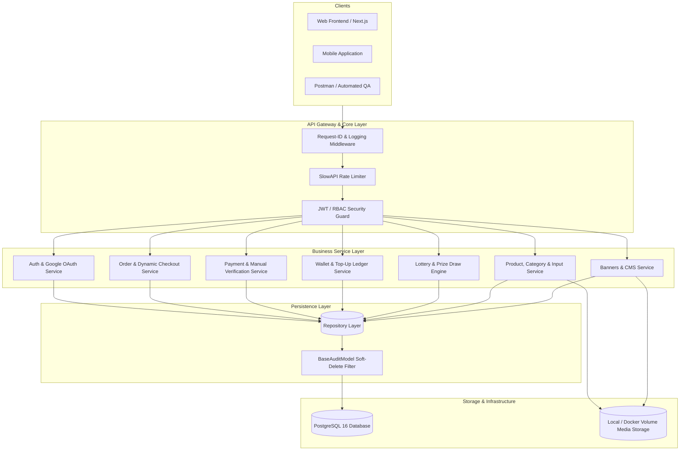

# Digital Product Selling System

<div align="center">

[](https://www.python.org/)
[](https://fastapi.tiangolo.com/)
[](https://www.postgresql.org/)
[](https://docs.astral.sh/uv/)
[](https://www.docker.com/)
[](https://beta.ruff.rs/docs/)
[](https://pytest.org/)
[](#-postman-collection--api-testing)

<p align="center">
  <strong>An enterprise-grade, high-concurrency digital goods and in-game currency e-commerce platform backend.</strong>
  <br />
  Designed with strict Layered Service-Repository architecture, dynamic customer input validation, dual-mode settlement (Manual Gateway + Automated Webhooks + Customer Wallet), verifiable lottery engines, and end-to-end distributed tracing.
</p>

</div>

---

## 📑 Table of Contents

- [System Overview](#-system-overview)
- [Architecture & Design Principles](#-architecture--design-principles)
- [System Architecture Diagram](#-system-architecture-diagram)
- [Comprehensive Feature Matrix](#-comprehensive-feature-matrix)
- [Tech Stack & Tooling](#-tech-stack--tooling)
- [Project Directory Structure](#-project-directory-structure)
- [Environment Configuration](#-environment-configuration)
- [Getting Started](#-getting-started)
  - [Quick Start with Make](#quick-start-with-make-recommended)
  - [Manual Setup with UV](#manual-setup-with-uv)
  - [Full Containerized Stack (Production Docker)](#full-containerized-stack-production-docker)
- [Database Seeding & Test Accounts](#-database-seeding--test-accounts)
- [Postman Collection & API Testing](#-postman-collection--api-testing)
- [API Route Conventions & Endpoints](#-api-route-conventions--endpoints)
- [Automated Testing & Code Quality](#-automated-testing--code-quality)
- [Database Migrations (Alembic)](#-database-migrations-alembic)
- [Production & Security Hardening](#-production--security-hardening)
- [Makefile Reference](#-makefile-reference)

---

## 🚀 System Overview

The **Digital Product Selling System** is an asynchronous, high-throughput backend engineered for digital product marketplaces (e.g., game top-ups like Free Fire / PUBG, streaming passes like Spotify / Netflix, software license keys, and digital gift cards).

### Key Business Capabilities
- **Zero-Friction Customer Onboarding**: Native Google OAuth2 ID token verification paired with an admin credential authentication gateway.
- **Dynamic Customer Input Engine**: Dynamic field requirements per product (e.g., Player ID, Zone ID, In-Game Name, Server Region) validated on checkout with runtime type & regex enforcement.
- **Multi-Tiered Package Architecture**: Products support multiple package variants with independent pricing, original strike-through prices, and real-time inventory states.
- **Discount & Coupon Engine**: Configurable percentage and fixed discounts enforcing minimum order thresholds, maximum discount caps, per-user usage limits, and expiration dates.
- **Omnichannel Settlement**:
  - **Manual Payment Gateways**: bKash, Nagad, and Rocket personal accounts with customer TrxID submission, duplicate TrxID prevention, and administrative verification queues.
  - **Automated Webhooks**: Extensible signature verification infrastructure for automated payment aggregators.
  - **Customer Wallet Ledger**: Pre-funded balance account with top-up approval pipelines and atomic checkout balance deductions.
- **Gamified Lottery & Lucky Spin Engine**: Time-delimited campaigns with ticket allocations, entry tracking, multi-tier prize pools, and auditable randomized winner selection.
- **Marketing & Content Management (CMS)**: Manage interactive hero carousel banners, promotional flash popup modals, and global site configurations without code deployments.
- **Real-Time Administrative Dashboard**: Instant visibility into today's sales volume, order counters, pending approvals, and chronological activity feeds.

---

## 🏛️ Architecture & Design Principles

The codebase strictly adheres to **Clean Architecture** and **Domain-Driven Design (DDD)** principles, guaranteeing high cohesion, loose coupling, and maximum testability:

```text
HTTP Request
    │
    ▼
┌────────────────────────────────────────────────────────┐
│  FastAPI Routing & Middleware Layer                   │
│  - Correlation ID Middleware (X-Request-ID)            │
│  - Rate Limiter (SlowAPI / Leaky Bucket)               │
│  - JWT Bearer Authentication & RBAC Dependencies      │
└──────────────────────────┬─────────────────────────────┘
                           │
                           ▼
┌────────────────────────────────────────────────────────┐
│  Application Service Layer (Business Logic)            │
│  - Orchestrates business workflows & transaction scopes│
│  - Executes domain validation (e.g., dynamic inputs)   │
│  - Enforces atomic state transitions & financial rules │
└──────────────────────────┬─────────────────────────────┘
                           │
                           ▼
┌────────────────────────────────────────────────────────┐
│  Data Access & Repository Layer (Persistence)          │
│  - Abstracts raw SQLAlchemy ORM queries                │
│  - Enforces query encapsulation and pagination         │
│  - Handles soft-delete scoping & audit tracking        │
└──────────────────────────┬─────────────────────────────┘
                           │
                           ▼
┌────────────────────────────────────────────────────────┐
│  PostgreSQL 16 Storage Layer                           │
│  - Relational integrity, FK constraints, and indexes   │
└────────────────────────────────────────────────────────┘
```

### Architectural Guardrails
1. **Strict Dependency Flow**: Routes never execute raw database queries or direct ORM writes. All logic flows downwards: `Routes -> Services -> Repositories -> Models`.
2. **DTO / Schema Encapsulation**: Strict Pydantic v2 validation models segregate external API payloads from internal database entities.
3. **Auditability by Default**: Every critical database entity inherits from `BaseAuditModel`, providing auto-updating `created_at`, `updated_at`, `is_deleted`, and `deleted_at` timestamps with safe `soft_delete()` and `restore()` mechanics.
4. **Idempotency & Concurrency Safety**: Wallet balances and financial transactions execute under explicit ACID transaction boundaries with rollback guarantees.
5. **Observability**: Distributed correlation tokens (`X-Request-ID`) flow seamlessly through ASGI middleware, ContextVars, structured JSON formatters, and downstream error envelopes.

---

## 📊 System Architecture Diagram



---

## 🧩 Comprehensive Feature Matrix

| Domain Module | Key Capabilities | Access Level |
| :--- | :--- | :--- |
| **Authentication** | Native Google OAuth2 ID token exchange, Admin credential login, JWT refresh token rotation, current profile query (`GET /me`), customer profile patch. | Public / Customer / Admin |
| **Admin - Users** | Paginated user accounts, administrative role promotion (`customer` ↔ `admin`), account status toggling, safe soft-deletion. | Admin |
| **Categories** | Hierarchical categorization of digital goods with sort ordering, icon URL mapping, and active/inactive visibility toggles. | Public (Read) / Admin (CRUD) |
| **Products & Inputs** | Digital product catalog with rich descriptions, image assets, category associations, and dynamic customer input fields (UID, Zone ID, Email). | Public (Read) / Admin (CRUD) |
| **Packages** | Multi-tier variants per product (e.g. `115 Diamonds`, `Weekly Pass`), stock status, custom pricing, and sort order. | Public (Read) / Admin (CRUD) |
| **Coupons** | Discount validation engine supporting `PERCENTAGE` (with maximum discount cap) and `FIXED` amount discounts, minimum spend thresholds, usage limits, and validity windows. | Customer (Validate) / Admin (CRUD) |
| **Orders & Checkout**| Comprehensive checkout pipeline capturing dynamic inputs, coupon redemption, automated subtotal/discount calculations, and direct-gateway or wallet-funded orders. | Customer / Admin |
| **Payment Methods** | Configurable payment channels (bKash, Nagad, Rocket, Bank Transfer) with custom instructions, account numbers, and dynamic QR images. | Public (Active) / Admin (All) |
| **Payments** | Payment initiation, manual transaction ID submission, administrative payment verification queue, and automated webhook routing. | Customer / Admin / Webhook |
| **Wallet & Top-Ups** | Stored customer balance ledger, top-up requests with manual TrxID submission, administrative approval/rejection pipeline, and automated balance credits. | Customer / Admin |
| **Lottery & Spins** | Promotional lotteries, ticket purchasing with wallet/direct balance, participant rosters, multi-rank prize configurations, and automated randomized winner draws. | Public / Customer / Admin |
| **Marketing CMS** | Dynamic homepage banners with CTA buttons, flash promotional popup modals, and active marketing asset management. | Public (Active) / Admin (CRUD) |
| **Site Settings** | Centralized configuration for platform branding, support contact lines (Phone, Email, Telegram, WhatsApp), and live alert notices. | Public (Read) / Admin (Update) |
| **Admin Dashboard** | Real-time KPI summaries: today's order count, today's sales volume, pending payments queue, pending top-up count, total users, and recent audit logs. | Admin |
| **Media Storage** | Multi-part file upload engine with MIME verification, subfolder categorization, and static delivery via `/media`. | Authenticated / Admin |
| **Health & Observability** | Zero-dependency health check probe (`/health`) reporting system status, database connection viability, versioning, and UTC timestamps. | Public / Docker / K8s |

---

## 🛠️ Tech Stack & Tooling

- **Core Framework**: [FastAPI](https://fastapi.tiangolo.com/) (0.115+) - Modern, high-performance async Python framework.
- **Language Runtime**: Python 3.12+ (leveraging modern union types and pattern matching).
- **Relational Database**: [PostgreSQL 16](https://www.postgresql.org/) - Robust relational ACID store.
- **ORM & Migrations**: [SQLAlchemy 2.0](https://www.sqlalchemy.org/) & [Alembic](https://alembic.sqlalchemy.org/) - Explicit SQL query generation with autogenerated migrations.
- **Validation & Serialization**: [Pydantic v2](https://docs.pydantic.dev/) & Pydantic Settings.
- **Package Management**: [Astral uv](https://docs.astral.sh/uv/) - 10-100x faster than traditional pip.
- **Authentication & Cryptography**: PyJWT (HMAC-SHA256) & Passlib with BCrypt.
- **Rate Limiting**: SlowAPI (in-memory or Redis-backed leaky bucket algorithms).
- **Code Standards & QA**: [Ruff](https://beta.ruff.rs/) (linting and formatting) & [Pytest](https://pytest.org/) (47 integration tests).
- **Containerization**: Multi-stage, non-root production `Dockerfile` & `docker-compose.yml`.

---

## 📁 Project Directory Structure

```text
.
├── alembic/                         # Database migrations
│   ├── versions/                    # Revision migration files
│   └── env.py                       # Alembic environment and model metadata
├── app/
│   ├── api/
│   │   └── routes/                  # API route handlers (v1)
│   │       ├── admin/               # Admin specific sub-routers
│   │       ├── auth.py              # Google OAuth & Admin login routes
│   │       ├── categories.py        # Category CRUD endpoints
│   │       ├── coupons.py           # Coupon validation & management
│   │       ├── dashboard.py         # Admin analytical KPIs
│   │       ├── health.py            # Infrastructure health probe
│   │       ├── lottery.py           # Lottery ticket & draw routes
│   │       ├── marketing.py         # Banners & flash popups
│   │       ├── media.py             # File upload and asset management
│   │       ├── orders.py            # Checkout and order tracking
│   │       ├── packages.py          # Product package variants
│   │       ├── payment_methods.py   # Gateway method configurations
│   │       ├── payments.py          # Payment initiation & verification
│   │       ├── products.py          # Products & dynamic custom fields
│   │       ├── settings.py          # Site settings configuration
│   │       ├── users.py             # Admin user administration
│   │       └── wallet.py            # Wallet balances & top-ups
│   ├── core/                        # Infrastructure core
│   │   ├── config.py                # Pydantic environment configuration
│   │   ├── database.py              # Engine, sessionmaker, and Base
│   │   ├── exceptions.py            # Standardized exception handlers
│   │   ├── limiter.py               # Rate limiter configuration
│   │   ├── logging.py               # Correlation ID ContextVar & JSON logger
│   │   ├── middleware.py            # X-Request-ID propagation & audit timing
│   │   └── security.py              # JWT token generation & RBAC dependencies
│   ├── enums/                       # Domain enumerations (OrderStatus, PaymentStatus, etc.)
│   ├── models/                      # SQLAlchemy Declarative Models
│   │   ├── base.py                  # BaseAuditModel (timestamps & soft-delete)
│   │   ├── category.py              # Category entity
│   │   ├── coupon.py                # Coupon entity
│   │   ├── lottery.py               # Lottery, LotteryPrize & LotteryEntry
│   │   ├── marketing.py             # Banner & Popup entities
│   │   ├── order.py                 # Order & OrderItem entities
│   │   ├── package.py               # Product package entity
│   │   ├── payment.py               # Payment transaction entity
│   │   ├── payment_method.py        # Payment gateway method entity
│   │   ├── product.py               # Product entity
│   │   ├── product_input_field.py   # Dynamic custom input configuration
│   │   ├── setting.py               # Global site setting entity
│   │   ├── topup.py                 # Wallet top-up request entity
│   │   ├── user.py                  # User account entity
│   │   └── wallet.py                # Customer wallet & transaction ledger
│   ├── repositories/                # Persistence & DB query abstractions
│   ├── schemas/                     # Pydantic DTOs for request/response validation
│   ├── services/                    # Domain business logic & transactional workflows
│   └── main.py                      # FastAPI application entrypoint & route registration
├── scripts/
│   ├── generate_postman_collection.py # Generator for Postman v2.1.0 JSON
│   └── seed.py                      # Idempotent database seeder
├── tests/                           # Complete integration test suite (47 tests)
├── uploads/                         # Statically served media uploads
├── Digital_Product_Selling_System.postman_collection.json # Ready-to-import Postman collection
├── Dockerfile                       # Multi-stage production container build
├── docker-compose.yml               # Local stack orchestration (Postgres + API)
├── Makefile                         # Cross-platform developer automation tasks
├── pyproject.toml                   # Project metadata, dependencies, and tooling configs
└── README.md                        # Documentation
```

---

## ⚙️ Environment Configuration

Configuration is managed through environment variables or a local `.env` file via `app/core/config.py`:

```bash
cp .env.example .env
```

| Variable | Type | Default | Description |
| :--- | :--- | :--- | :--- |
| `PROJECT_NAME` | string | `Digital Product Selling System` | Application display name |
| `API_V1_STR` | string | `/api/v1` | URL prefix for all business API routes |
| `DEBUG` | boolean | `false` | Enable verbose tracebacks (keep `false` in production) |
| `DB_USER` | string | `postgres` | PostgreSQL username |
| `DB_PASSWORD` | string | `password` | PostgreSQL password |
| `DB_HOST` | string | `localhost` | PostgreSQL host (`db` inside Docker network) |
| `DB_PORT` | integer | `5433` | PostgreSQL port (mapped to `5433` locally, `5432` internal) |
| `DB_NAME` | string | `digital_product_db` | Target PostgreSQL database name |
| `JWT_SECRET_KEY` | string | `change-this-in-production` | Secret key used for signing JWT tokens |
| `JWT_ALGORITHM` | string | `HS256` | Cryptographic algorithm for JWT signature |
| `ACCESS_TOKEN_EXPIRE_MINUTES`| integer | `60` | Lifespan of access tokens in minutes |
| `REFRESH_TOKEN_EXPIRE_DAYS` | integer | `7` | Lifespan of refresh tokens in days |
| `GOOGLE_CLIENT_ID` | string | `""` | Google Cloud Console OAuth 2.0 Client ID |
| `LOG_LEVEL` | string | `INFO` | Logging threshold (`DEBUG`, `INFO`, `WARNING`, `ERROR`) |
| `LOG_FORMAT` | string | `console` | `console` (human-readable) or `json` (production cloud format) |

---

## 🏁 Getting Started

### Prerequisites
- [Python 3.12+](https://www.python.org/downloads/)
- [Astral uv](https://docs.astral.sh/uv/getting-started/installation/) (`curl -LsSf https://astral.sh/uv/install.sh | sh`)
- [Docker](https://docs.docker.com/get-docker/) & Docker Compose

---

### Quick Start with Make (Recommended)

```bash
# 1. Initialize project (installs dependencies, starts Postgres, applies migrations)
make setup

# 2. Seed initial data (Admin user, regular customer, sample categories, products, packages)
make seed

# 3. Start local development server with instant hot-reload
make dev
```
The API is now live at **`http://localhost:8000`**!

---

### Manual Setup with UV

If you prefer running commands directly without `make`:

```bash
# 1. Install dependencies into isolated virtual environment
uv sync

# 2. Start PostgreSQL container
docker compose up -d --wait db

# 3. Run database migrations to head
uv run alembic upgrade head

# 4. Populate seed data
uv run python scripts/seed.py

# 5. Launch FastAPI development server
uv run uvicorn app.main:app --reload --host 0.0.0.0 --port 8000
```

---

### Full Containerized Stack (Production Docker)

Run the entire stack (FastAPI ASGI application + PostgreSQL 16) fully isolated in Docker:

```bash
# Build and run the entire stack in background
make docker-up

# Follow live container logs
make docker-logs

# Tear down the container stack
make docker-down
```

---

## 🌱 Database Seeding & Test Accounts

The project includes an **idempotent** seeder that populates complete demonstration data without creating duplicate records on repeated executions:

```bash
make seed
```

### Pre-Configured Test Credentials

| Role | Email | Password | Access Rights |
| :--- | :--- | :--- | :--- |
| **Super Admin** | `admin@example.com` | `admin123` | Full access to `/api/v1/admin/*` endpoints and analytics dashboard |
| **Customer** | `user@example.com` | `user123` | Access to customer checkout, personal orders, wallet, and lotteries |

---

## 📮 Postman Collection & API Testing

A complete, production-ready **Postman Collection v2.1.0** is included directly in the root of the repository:

📄 **File**: [`Digital_Product_Selling_System.postman_collection.json`](file:///home/atik/Codes/python/fast%20api/digital%20product%20selling%20system/Digital_Product_Selling_System.postman_collection.json)

### Collection Features:
- **16 Feature-Specific Folders**: Covering all 88 individual endpoints.
- **Automated JWT Token Management**: Calling `[Public (Admin Login)] Admin credential login` or `[Public] Google OAuth` automatically captures `access_token` and `admin_token` into collection variables.
- **Pre-filled Realistic Payloads**: Every single POST and PUT request comes pre-configured with production-realistic JSON request bodies (real game top-up packages, dynamic UID payloads, coupon validation, bKash TrxID verification, etc.).
- **Regeneration Support**: If endpoints or schemas evolve, regenerate the collection anytime:
  ```bash
  make postman
  ```

---

## 🌐 API Route Conventions & Endpoints

All business, customer, and administration routes are mounted strictly under the **`/api/v1/`** prefix.

### Interactive API Explorers
- **Swagger UI**: [`http://localhost:8000/docs`](http://localhost:8000/docs)
- **ReDoc Documentation**: [`http://localhost:8000/redoc`](http://localhost:8000/redoc)
- **OpenAPI 3.1 JSON Specification**: [`http://localhost:8000/openapi.json`](http://localhost:8000/openapi.json)

### Core Endpoint Summary

#### 1. Authentication & Profile
- `POST /api/v1/auth/admin/login` - Admin credential authentication
- `POST /api/v1/auth/google` - Customer Google OAuth2 ID token authentication
- `POST /api/v1/auth/refresh` - Refresh expired access token
- `GET /api/v1/auth/me` - Fetch authenticated user profile
- `PATCH /api/v1/auth/me` - Update profile information

#### 2. Catalog & Dynamic Input Fields
- `GET /api/v1/categories` - List active public categories
- `GET /api/v1/products` - List products (filterable by category, search term)
- `GET /api/v1/products/{product_id}` - Detailed product specifications with required custom inputs
- `GET /api/v1/products/{product_id}/packages` - List purchase options for a product
- `POST /api/v1/admin/products/{product_id}/inputs` - Configure a dynamic field (e.g. `player_id`)

#### 3. Checkout, Orders & Coupons
- `POST /api/v1/coupons/validate` - Validate discount code against target package & quantity
- `POST /api/v1/orders/checkout` - Create new order with customer inputs & optional wallet payment
- `GET /api/v1/orders/my-orders` - Retrieve customer order history
- `GET /api/v1/admin/orders` - Comprehensive order list for administration
- `PUT /api/v1/admin/orders/{order_id}/status` - Update order fulfillment status (`COMPLETED`, `CANCELLED`)

#### 4. Payments, Settlement & Wallets
- `GET /api/v1/payment-methods` - Active payment gateways (bKash, Nagad, etc.)
- `POST /api/v1/payments/initiate` - Initiate order payment settlement
- `POST /api/v1/payments/verify-manual` - Submit customer manual payment transaction ID
- `GET /api/v1/admin/payments/pending` - Review pending payment verification queue
- `PUT /api/v1/admin/payments/{payment_id}/verify` - Approve/Reject manual payment transaction
- `GET /api/v1/wallet` - View customer wallet balance
- `POST /api/v1/wallet/topup` - Submit wallet balance top-up request
- `PUT /api/v1/admin/wallet/topups/{topup_id}/approve` - Approve wallet top-up & credit balance

#### 5. Lottery & Marketing
- `GET /api/v1/lotteries/active` - List active public lotteries
- `POST /api/v1/lotteries/{lottery_id}/participate` - Purchase lottery ticket
- `POST /api/v1/admin/lotteries/{lottery_id}/draw` - Execute randomized winner draw
- `GET /api/v1/banners` - Active hero carousel banners
- `GET /api/v1/popups/active` - Active promotional popup modal
- `GET /api/v1/settings` - Public site configuration

---

## 🧪 Automated Testing & Code Quality

The project features a comprehensive automated test suite testing all 14 domain modules using isolated, in-memory SQLite transactions with zero side-effects on the development database.

```bash
# Run the complete test suite
make test
```

### Test Suite Execution Output
```text
============================= test session starts ==============================
platform linux -- Python 3.12.13, pytest-9.1.0
rootdir: /home/atik/Codes/python/fast api/digital product selling system
collected 47 items                                                             

tests/test_admin_dashboard.py .                                          [  2%]
tests/test_audit_and_soft_delete.py ..                                   [  6%]
tests/test_auth.py ........                                              [ 23%]
tests/test_categories.py .                                               [ 25%]
tests/test_coupons.py ..                                                 [ 29%]
tests/test_dynamic_inputs.py ....                                        [ 38%]
tests/test_health.py .                                                   [ 40%]
tests/test_logging_and_tracing.py ....                                   [ 48%]
tests/test_lottery.py .                                                  [ 51%]
tests/test_marketing_and_settings.py ..                                  [ 55%]
tests/test_orders_and_checkout.py ..                                     [ 59%]
tests/test_packages.py .                                                 [ 61%]
tests/test_payment_methods.py .                                          [ 63%]
tests/test_payments.py ..                                                [ 68%]
tests/test_products.py ........                                          [ 85%]
tests/test_seed.py ..                                                    [ 89%]
tests/test_topups.py ..                                                  [ 93%]
tests/test_wallet.py ...                                                 [100%]

============================= 47 passed in 15.75s ==============================
```

### Code Formatting & Linting
Enforce enterprise clean-code standards with [Ruff](https://beta.ruff.rs/):

```bash
# Check code for linting errors
make lint

# Automatically format code
make format
```

---

## 🗄️ Database Migrations (Alembic)

Database schema evolution is managed through Alembic revisions:

```bash
# 1. Create a new autogenerated migration after modifying SQLAlchemy models
make migration m="add_new_feature_table"

# 2. Apply pending migrations to the database
make migrate

# 3. Rollback the most recent migration revision
make rollback

# 4. View current database revision
make migrate-status
```

---

## 🛡️ Production & Security Hardening

- **Non-Root Docker Execution**: The production Docker container executes under a dedicated `appuser` (UID 10001), preventing host root escalation.
- **Distributed Request Tracing**: Every inbound request receives an `X-Request-ID` header, correlated across all logs, downstream services, and error payloads.
- **Structured JSON Logging**: Switch between human-readable development logs and high-performance JSON logs (`LOG_FORMAT=json`) ready for ingestion into Datadog, ELK, or AWS CloudWatch.
- **SlowAPI Rate Limiting**: Critical authentication endpoints (e.g. login, OAuth exchange) are shielded against brute-force attacks via configurable leaky-bucket limits (`10/minute`, `15/minute`).
- **Safe Soft Deletion**: Records retain historic integrity and audit compliance via `is_deleted` and `deleted_at` attributes.

---

## 📋 Makefile Reference

| Target | Description |
| :--- | :--- |
| `make help` | Display available Makefile targets and descriptions |
| `make setup` | Install dependencies, boot PostgreSQL container, and apply migrations |
| `make dev` | Start Uvicorn development server with instant hot-reload |
| `make db-up` | Start PostgreSQL container and verify migrations |
| `make db-down` | Stop PostgreSQL container without destroying data |
| `make db-reset` | Tear down database volume and rerun all migrations from scratch |
| `make seed` | Populate database with idempotent seed records (admin, user, products, etc.) |
| `make docker-build`| Build multi-stage production Docker image |
| `make docker-up` | Run full container stack (API + DB) in background |
| `make docker-down` | Stop all stack containers |
| `make docker-logs` | Stream live logs from the API container |
| `make migration` | Create new migration revision (Usage: `make migration m="description"`) |
| `make migrate` | Run all pending migrations (`alembic upgrade head`) |
| `make rollback` | Revert the latest migration (`alembic downgrade -1`) |
| `make migrate-status` | Display current database schema revision |
| `make test` | Execute Pytest test suite (47 automated tests) |
| `make lint` | Run Ruff linter across entire codebase |
| `make format` | Automatically format all code using Ruff |
| `make postman` | Regenerate the complete Postman Collection v2.1.0 JSON file |

---

<div align="center">
  <sub>Engineered with precision for performance, security, and scalability.</sub>
</div>
