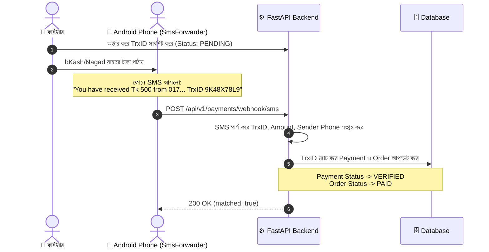

# 📱 SmsForwarder (Android) Integration & Setup Guide

> **Target App**: [pppscn/SmsForwarder (短信转发器)](https://github.com/pppscn/SmsForwarder)  
> **Backend Endpoint**: `POST /api/v1/payments/webhook/sms`  
> **Supported Providers**: **bKash**, **Nagad**, **Rocket (16216)**  
> **Purpose**: Android ডিভাইসে আসা পেমেন্ট কনফার্মেশন SMS স্বয়ংক্রিয়ভাবে ব্যাকএন্ডে পাঠিয়ে Order ও Wallet Top-Up অটোমেটিক ভেরিফাই ও অ্যাক্টিভ করা।

---

## 📑 সূচিপত্র (Table of Contents)
1. [সিস্টেম ওভারভিউ (How it Works)](#-১-সিস্টেম-ওভারভিউ-how-it-works)
2. [প্রয়োজনীয় প্রস্তুতি (Prerequisites)](#-২-প্রয়োজনীয়-প্রস্তুতি-prerequisites)
3. [SmsForwarder অ্যাপ কনফিগারেশন](#-৩-smsforwarder-অ্যাপ-কনফিগারেশন-ধাপে-ধাপে)
   - [ধাপ ১: Webhook Sender চ্যানেল তৈরি](#ধাপ-১-webhook-sender-চ্যানেল-তৈরি)
   - [ধাপ ২: Forwarding Rule (ফরওয়ার্ডিং নিয়ম) সেটআপ](#ধাপ-২-forwarding-rule-ফরওয়ার্ডিং-নিয়ম-সেটআপ)
   - [ধাপ ৩: ফোনের ব্যাকগ্রাউন্ড ও ব্যাটারি পারমিশন](#ধাপ-৩-ফোনের-ব্যাকগ্রাউন্ড-ও-ব্যাটারি-পারমিশন-জরুরি)
4. [ম্যানুয়াল টেস্টিং (cURL Example)](#-৪-ম্যানুয়াল-টেস্টিং-curl-example)
5. [এডমিন প্যানেলে SMS লগ মনিটরিং](#-৫-এডমিন-প্যানেলে-sms-লগ-মনিটরিং)
6. [সাধারণ সমস্যা ও সমাধান (Troubleshooting)](#-৬-সাধারণ-সমস্যা-ও-সমাধান-troubleshooting)

---

## 🔄 ১. সিস্টেম ওভারভিউ (How it Works)



> [!TIP]
> **Dual-Direction Matching**: 
> - **আগে পেমেন্ট সাবমিট, পরে SMS আসলে**: সাথে সাথে পেমেন্ট `VERIFIED` এবং অর্ডার `PAID` হবে।
> - **আগে SMS আসলে, পরে কাস্টমার TrxID সাবমিট করলে**: সাবমিট করার সাথে সাথেই পূর্বের SMS এর সাথে মিলিয়ে অর্ডার অটো-ভেরিফাই হয়ে যাবে!

---

## 🛠️ ২. প্রয়োজনীয় প্রস্তুতি (Prerequisites)

1. **Android ফোন**: Android 5.0 বা তার পরবর্তী ভার্সন চালিত একটি ফোন যাতে আপনার bKash/Nagad/Rocket এর সিম কার্ডটি ইনসার্ট করা আছে।
2. **SmsForwarder APK ডাউনলোড**: 
   - [GitHub Releases](https://github.com/pppscn/SmsForwarder/releases) পেজ থেকে লেটেস্ট APK ফাইলটি (`app-release.apk`) ডাউনলোড করে ফোনে ইনস্টল করুন।
3. **Backend Secret Key**:
   - ব্যাকএন্ডের `.env` ফাইলে `SMS_WEBHOOK_SECRET` সেট করা থাকতে হবে:
     ```env
     SMS_WEBHOOK_SECRET=your-strong-random-secret-key-12345
     ```
4. **পাবলিক ব্যাকএন্ড URL**:
   - প্রোডাকশন: `https://api.yourdomain.com/api/v1/payments/webhook/sms`
   - লোকাল টেস্টিং: [Ngrok](https://ngrok.com) বা [Cloudflare Tunnel](https://developers.cloudflare.com/cloudflare-one/connections/connect-networks/) ব্যবহার করুন (যেমন: `https://xxxx.ngrok-free.app/api/v1/payments/webhook/sms`)।

---

## ⚙️ ৩. SmsForwarder অ্যাপ কনফিগারেশন (ধাপে ধাপে)

### ধাপ ১: Webhook Sender চ্যানেল তৈরি

1. অ্যাপ ওপেন করে নিচে **Sender (发送通道)** ট্যাবে যান।
2. নতুন চ্যানেল অ্যাড করতে উপরে ডানদিকের **`+`** আইকনে ক্লিক করুন।
3. চ্যানেল টাইপ হিসেবে **`Webhook`** সিলেক্ট করুন।
4. ফিল্ডগুলো নিচের তথ্যানুযায়ী পূরণ করুন:

| ফিল্ডের নাম | মান (Value) | বিবরণ |
| :--- | :--- | :--- |
| **Name / 通道名称** | `Digital Product Backend` | চ্যানেলের নাম |
| **WebHook URL** | `https://api.yourdomain.com/api/v1/payments/webhook/sms` | আপনার ব্যাকএন্ডের পূর্ণ URL |
| **Request Method** | `POST` | মেথড POST হতে হবে |

#### অথেনটিকেশন (Secret) কনফিগার করার ২টি সহজ উপায়:

* **পদ্ধতি ১ (Header - রিকমেন্ডেড)**:
  **Headers (请求头)** বক্সে লিখুন:
  ```http
  Content-Type: application/json
  X-Device-Secret: your-strong-random-secret-key-12345
  ```

* **পদ্ধতি ২ (URL Query Parameter - সবচেয়ে সহজ)**:
  যদি হেডার দিতে সমস্যা হয়, সরাসরি URL-এর শেষে `?secret=...` যুক্ত করুন:
  ```
  https://api.yourdomain.com/api/v1/payments/webhook/sms?secret=your-strong-random-secret-key-12345
  ```

#### WebHook Post Template (বডি টেমপ্লেট):

ব্যাকএন্ড এখন **SmsForwarder** এর ডিফল্ট ফরম্যাট এবং কাস্টম ফরম্যাট উভয়ই সাপোর্ট করে। যেকোনো একটি ব্যবহার করতে পারেন:

* **রিকমেন্ডেড সহজ টেমপ্লেট (JSON - সবচেয়ে নিরাপদ)**:
  ```json
  {
    "sender": "[from]",
    "message": "[org_content]"
  }
  ```
  *(নোট: শুধুমাত্র sender ও message থাকলেই ব্যাকএন্ড সমস্ত পেমেন্ট ভেরিফাই করতে পারে)*

* **অথবা পূর্ণাঙ্গ টেমপ্লেট (সবগুলো ফিল্ড ডবল কোটেশনের `""` ভেতরে রাখবেন)**:
  ```json
  {
    "sender": "[from]",
    "message": "[org_content]",
    "sim_slot": "[sim_slot]",
    "device_id": "[device_mark]",
    "timestamp": "[timestamp]"
  }
  ```
  *(সতর্কতা: `"[sim_slot]"` এর দুই পাশে কোটেশন না দিলে ফোনে "SIM1" বা টেক্সট আসলে JSON ভেঙে গিয়ে 422 এরর দিতে পারে)*

* **অথবা ডিফল্ট (যদি বডি টেমপ্লেট সম্পূর্ণ ফাঁকা রাখেন)**:
  SmsForwarder স্বয়ংক্রিয়ভাবে ফর্ম-ডাটা হিসেবে পাঠাবে, যা ব্যাকএন্ড কোনো সমস্যা ছাড়াই এক্সেপ্ট করবে।

5. নিচে থাকা **Test (测试)** বাটনে ক্লিক করুন। যদি ব্যাকএন্ড চালু থাকে, আপনি রেসপন্সে `{ "success": true, ... }` দেখতে পাবেন।
6. এরপর **Save (保存)** বাটনে ক্লিক করুন।

---

### ধাপ ২: Forwarding Rule (ফরওয়ার্ডিং নিয়ম) সেটআপ

1. অ্যাপের **Rule (转发规则)** ট্যাবে যান।
2. উপরে ডানদিকের **`+`** আইকনে ক্লিক করুন।
3. অপশনগুলো নিচের মতো সেট করুন:
   - **Type**: `SMS`
   - **Sender Channel**: ধাপ ১-এ সেভ করা `Digital Product Backend` সিলেক্ট করুন।
   - **Match Field (匹配字段)**: `Sender (发送者)` অথবা `Content (内容)`
   - **Match Mode (匹配模式)**: `Contains (包含)`
   - **Match Value (匹配的值)**:
     ```
     bKash,Nagad,16216,Rocket
     ```
     *(নোট: কমা দিয়ে একাধিক নাম দেওয়া যায়। আপনি চাইলে ফাঁকা রেখে সব SMS ফরোয়ার্ড করতে পারেন, ব্যাকএন্ড নিজে থেকেই শুধুমাত্র ভ্যালিড পেমেন্ট SMS প্রসেস করবে এবং বাকিগুলো ইগনোর করবে)*
   - **SIM Slot**: যদি ফোনে দুটি সিম থাকে এবং নির্দিষ্ট সিমে টাকা আসে, তবে সেই সিমটি (SIM1 / SIM2) সিলেক্ট করুন, অন্যথায় `All` রাখুন।
4. **Save (保存)** এ ক্লিক করে রুলটি একটিভ করুন।

---

### ধাপ ৩: ফোনের ব্যাকগ্রাউন্ড ও ব্যাটারি পারমিশন (জরুরি)

Android OS সাধারণত ব্যাকগ্রাউন্ড অ্যাপস কিল করে দেয়। ফোন লক থাকলেও যেন SMS মিস না হয়, তার জন্য নিচের ৩টি সেটিংস নিশ্চিত করুন:

1. **Battery Optimization**:
   - ফোনের Settings -> Apps -> `SmsForwarder` -> Battery -> **"Unrestricted"** অথবা **"Don't Optimize"** সিলেক্ট করুন।
2. **Autostart / Background Run**:
   - Xiaomi/Realme/Oppo/Vivo ফোনে: Settings -> App Permissions -> `Autostart` অপশনে গিয়ে SmsForwarder অন করুন।
3. **Lock in Recent Apps (রিসেন্ট অ্যাপ লক)**:
   - ফোনের Recent Apps মেনু ওপেন করে SmsForwarder কার্ডটির উপর লং-প্রেস করে **Lock (তালা)** আইকনে ট্যাপ করুন।
4. **Notification / SMS Permission**:
   - অ্যাপটিকে SMS পড়ার পারমিশন এবং Notifications পারমিশন সম্পূর্ণ এলাউ (Allow) রাখুন।

---

## 🧪 ৪. ম্যানুয়াল টেস্টিং (cURL Example)

ব্যাকএন্ডের webhook টি ঠিকমতো কাজ করছে কিনা তা টার্মিনাল থেকেই নিচের cURL কমান্ড দিয়ে টেস্ট করতে পারেন:

### ক. Header দিয়ে টেস্ট:
```bash
curl -X POST "http://localhost:8000/api/v1/payments/webhook/sms" \
  -H "Content-Type: application/json" \
  -H "X-Device-Secret: default-secure-sms-device-secret-key-change-in-prod" \
  -d '{
    "sender": "bKash",
    "message": "You have received Tk 500.00 from 01711223344. Fee Tk 0.00. Balance Tk 1,234.50. TrxID 9K48X78L9 at 11/09/2026 02:05"
  }'
```

### খ. Query Parameter দিয়ে টেস্ট (SmsForwarder Aliases সহ):
```bash
curl -X POST "http://localhost:8000/api/v1/payments/webhook/sms?secret=default-secure-sms-device-secret-key-change-in-prod" \
  -H "Content-Type: application/json" \
  -d '{
    "from": "Nagad",
    "content": "Customer: 01822334455\nAmount: Tk 1,250.00\nTxnID: 71KJ892K\nBalance: Tk 3,500.00\nTime: 11/09/2026 02:10",
    "card_slot": 1,
    "device_mark": "My Store Phone"
  }'
```

**প্রত্যাশিত রেসপন্স (Success Response):**
```json
{
  "success": true,
  "status_code": 200,
  "message": "SMS recorded, not an incoming payment / Auto-verified via SMS Webhook",
  "data": {
    "received": true,
    "matched": true,
    "provider": "BKASH",
    "transaction_id": "9K48X78L9",
    "amount": 500.0,
    "sender_phone": "01711223344",
    "matched_entity_type": "ORDER_PAYMENT",
    "matched_entity_id": 12,
    "message": "Payment verified and order marked as PAID"
  }
}
```

---

## 📊 ৫. এডমিন প্যানেলে SMS লগ মনিটরিং

ফোনের পাঠানো প্রতিটি SMS ব্যাকএন্ডের ডাটাবেজে সংরক্ষিত থাকে। এডমিন প্যানেল বা API দিয়ে যেকোনো সময় হিস্ট্রি দেখা যাবে:

* **Endpoint**: `GET /api/v1/admin/payments/sms-logs`
* **Query Filters**:
  * `is_matched=true|false`: পেমেন্ট ম্যাচ হয়েছে কিনা ফিল্টার করতে
  * `provider=BKASH|NAGAD|ROCKET`: নির্দিষ্ট প্রোভাইডার দেখতে
  * `search=9K48X78L9`: নির্দিষ্ট TrxID বা ফোন নাম্বার সার্চ করতে

---

## ❓ ৬. সাধারণ সমস্যা ও সমাধান (Troubleshooting)

| সমস্যা | সম্ভাব্য কারণ | সমাধান |
| :--- | :--- | :--- |
| **401 Unauthorized** | সিক্রেট কী মেলেনি | অ্যাপের হেডার `X-Device-Secret` অথবা `?secret=` এর সাথে ব্যাকএন্ডের `.env` ফাইলে থাকা `SMS_WEBHOOK_SECRET` এর মান হুবহু মিলিয়ে নিন। |
| **422 Unprocessable Entity** | রিকোয়েস্টে sender বা message পাওয়া যায়নি | অ্যাপের JSON টেমপ্লেটে `[from]` এবং `[org_content]` বা `[content]` ফিল্ড সঠিকভাবে দেওয়া আছে কিনা চেক করুন। |
| **Network Error / Timeout** | সার্ভার আইপি বা ডোমেইনে ফোন পৌঁছাতে পারছে না | ফোন এবং সার্ভার যদি একই লোকাল ওয়াইফাইতে থাকে, তবে লোকাল আইপি (`192.168.x.x`) দিন অথবা Ngrok/Cloudflare দিয়ে পাবলিক ডোমেইন ব্যবহার করুন। |
| **স্ক্রিন বন্ধ থাকলে SMS ফরওয়ার্ড হয় না** | Android Battery Saver অ্যাপ বন্ধ করে দিয়েছে | ধাপ ৩ অনুযায়ী Battery Optimization "Unrestricted" করুন এবং Autostart অন করুন। |
| **ডুপ্লিকেট ট্রানজেকশন** | একই SMS দুবার ফরোয়ার্ড হলে | সিস্টেম স্বয়ংক্রিয়ভাবে TrxID চেক করে Idempotent রাখে, অর্থাৎ একই TrxID দিয়ে দুবার টাকা যোগ হবে না। |
