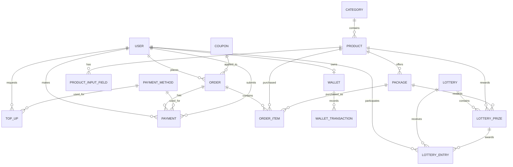

# Digital Products & Services Platform — SRS

## 1. Project Overview

A digital products/services e-commerce platform similar in business model to BoostGhor, where users can browse digital products, select packages, submit required product-specific information, pay through a custom payment verification flow, and track their orders.

The system will have:

- Public customer website
- Customer authentication
- Product/category/package management
- Dynamic product input fields
- checkout and order management
- Coupon management
- User wallet/top-up management
- Custom payment verification
- Lottery/discount campaign management
- Banner, popup and site configuration
- Admin dashboard

Authentication will use **Clerk with Google Sign-In**.

---

# 2. User Roles

## 2.1 Customer

Customers can:

- Sign in with Google through Clerk
- Browse categories and products
- View product packages
- Submit required product information
- Apply coupons
- Place orders
- Submit payment transaction information
- View order status/history
- View wallet balance
- Submit wallet top-up requests
- View wallet transaction history
- Participate in eligible lottery campaigns

## 2.2 Admin

Admins can:

- Manage categories
- Manage products
- Manage product input fields
- Manage packages
- Manage orders
- Manage payments
- Manage users
- Manage wallets/top-ups
- Manage coupons
- Manage lottery campaigns
- Manage banners
- Manage popups
- Manage payment methods
- Manage site settings

---

# 3. Functional Requirements

## 3.1 Authentication

### Customer

- Google authentication through Clerk.
- On first successful authentication, a local user record is created.
- Clerk user ID is stored against the local user.
- Customer profile information is synchronized from Clerk where required.
- Customer can access authenticated features only after login.

### User Data

```text
User
- id
- clerk_user_id
- name
- email
- image
- phone
- is_active
- created_at
- updated_at
```

Password management is handled by Clerk and is not stored in the application database.

---

# 4. Category Management

Admin can:

- Create category
- Update category
- Delete/deactivate category
- Upload category image
- Set display order
- Activate/deactivate category

### Category

```text
Category
- id
- name
- slug
- image
- description
- is_active
- sort_order
- created_at
- updated_at
```

Relationship:

```text
Category 1 ─────── N Product
```

---

# 5. Product Management

A product represents a digital service/product.

Examples:

- Netflix
- Spotify
- Canva Pro
- Facebook Followers
- TikTok Views
- Game Top-Up

Admin can:

- Create product
- Assign category
- Upload product image
- Add description
- Add product instructions
- Configure required customer input fields
- Activate/deactivate product
- Set display order

### Product

```text
Product
- id
- category_id
- name
- slug
- image
- description
- instructions
- is_active
- sort_order
- created_at
- updated_at
```

---

# 6. Product Input Field Management

Products can require different information from customers.

Examples:

### Netflix

```text
Email
Profile Name
```

### Facebook Followers

```text
Facebook Profile URL
```

### Game Top-Up

```text
Player ID
Server ID
```

Input fields must be configurable from the admin panel.

### ProductInputField

```text
ProductInputField
- id
- product_id
- name
- label
- type
- placeholder
- is_required
- sort_order
- created_at
- updated_at
```

Supported field types:

```text
text
email
number
url
textarea
```

Relationship:

```text
Product 1 ─────── N ProductInputField
```

---

# 7. Package Management

A package is a purchasable option of a product.

Example:

```text
Netflix
├── 1 Month
├── 3 Months
└── 6 Months
```

Admin can:

- Create package
- Assign package to product
- Set package price
- Set compare-at price
- Set duration
- Add package description
- Activate/deactivate package
- Set display order

### Package

```text
Package
- id
- product_id
- name
- price
- compare_price
- duration
- description
- is_active
- sort_order
- created_at
- updated_at
```

Relationship:

```text
Product 1 ─────── N Package
```

---

# 8. Product Browsing

Customers can:

- View all active categories
- View products by category
- Search products
- View product details
- View available packages
- Select a package
- See package price
- Fill required product input fields

Only active categories, products and packages are displayed publicly.

---


# 10. Order Management

An order represents a customer's purchase.

Admin can:

- View all orders
- Filter orders by status
- View order details
- Update order status
- Add admin notes
- Process order
- Mark order as completed
- Cancel order
- Refund order where applicable

### Order

```text
Order
- id
- user_id
- order_number
- subtotal
- discount
- total_amount
- coupon_id
- status
- customer_note
- admin_note
- created_at
- updated_at
```

### Order Status

```text
PENDING
PAYMENT_PENDING
PAID
PROCESSING
COMPLETED
CANCELLED
FAILED
REFUNDED
```

---

# 11. Order Item

An order can contain one or more products/packages.

### OrderItem

```text
OrderItem
- id
- order_id
- product_id
- package_id
- product_name
- package_name
- unit_price
- quantity
- total_price
- input_values
- created_at
```

`product_name`, `package_name` and `unit_price` are stored as order snapshots so historical orders remain unchanged if the product/package is later edited.

---

# 12. Checkout

Checkout flow:

```text
Review Items
  ↓
Apply Coupon
  ↓
Calculate Total
  ↓
Select Payment Method
  ↓
Create Order
  ↓
Payment Submission
```

The final order amount must be calculated on the backend.

The client must not be trusted for price or discount calculations.

---

# 13. Coupon Management

Admin can:

- Create coupon
- Update coupon
- Activate/deactivate coupon
- Set discount type
- Set discount value
- Set minimum order amount
- Set maximum discount
- Set usage limit
- Set per-user usage limit
- Set start/end date

### Coupon

```text
Coupon
- id
- code
- type
- value
- max_discount
- minimum_order_amount
- usage_limit
- per_user_limit
- starts_at
- expires_at
- is_active
- created_at
- updated_at
```

### Coupon Types

```text
FIXED
PERCENTAGE
```

Coupon validation must happen on the backend.

---

# 14. Wallet Management

Each customer can have one wallet.

### Wallet

```text
Wallet
- id
- user_id
- balance
- created_at
- updated_at
```

The wallet balance must not be changed directly without creating a corresponding wallet transaction.

---

# 15. Wallet Transactions

Every wallet balance change must create a transaction.

### WalletTransaction

```text
WalletTransaction
- id
- wallet_id
- type
- amount
- balance_before
- balance_after
- reference_type
- reference_id
- description
- created_at
```

### Transaction Types

```text
TOPUP
PURCHASE
REFUND
ADJUSTMENT
BONUS
```

Examples:

```text
Top-up:
balance_before = 500
amount = +1000
balance_after = 1500

Purchase:
balance_before = 1500
amount = -399
balance_after = 1101
```

---

# 16. Wallet Top-Up

Customers can submit a top-up request.

Top-up flow:

```text
Customer
   ↓
Select Top-Up Amount
   ↓
Select Payment Method
   ↓
Make Payment
   ↓
Submit Transaction ID
   ↓
Top-Up Request = PENDING
   ↓
Admin Verification
   ↓
APPROVED / REJECTED
```

### TopUp

```text
TopUp
- id
- user_id
- payment_method_id
- amount
- transaction_id
- sender_number
- status
- admin_note
- verified_by
- verified_at
- created_at
- updated_at
```

### Top-Up Status

```text
PENDING
APPROVED
REJECTED
```

When a top-up is approved:

1. Wallet balance is increased.
2. WalletTransaction is created.
3. TopUp status becomes `APPROVED`.

---

# 17. Payment Method Management

Admin can manage available payment methods.

Examples:

```text
bKash
Nagad
Rocket
```

### PaymentMethod

```text
PaymentMethod
- id
- name
- account_number
- instructions
- logo
- is_active
- sort_order
- created_at
- updated_at
```

Customers only see active payment methods.

---

# 18. Custom Payment System

The system will use a custom payment submission and verification flow.

Customer flow:

```text
Checkout
   ↓
Payment Page
   ↓
Select Payment Method
   ↓
Show Payment Instructions
   ↓
Customer completes payment externally
   ↓
Customer enters transaction ID
   ↓
Customer submits payment
   ↓
Payment = VERIFYING
   ↓
Admin verifies
   ↓
APPROVED / REJECTED
```

The system does not assume automatic transaction verification unless an official payment-provider API is integrated.

---

# 19. Payment Management

### Payment

```text
Payment
- id
- order_id
- user_id
- payment_method_id
- amount
- transaction_id
- sender_number
- status
- verified_by
- verified_at
- admin_note
- created_at
- updated_at
```

### Payment Status

```text
PENDING
VERIFYING
VERIFIED
REJECTED
EXPIRED
```

### Payment Verification

Admin can:

- View pending payments
- View payment details
- View associated user
- View associated order
- View product/package
- View payment method
- View amount
- View transaction ID
- Approve payment
- Reject payment
- Add verification note

When a payment is verified:

```text
Payment = VERIFIED
Order = PAID
```

The order can then be processed.

When rejected:

```text
Payment = REJECTED
Order = PAYMENT_PENDING
```

---

# 20. Payment and Order Relationship

```text
User
  │
  └──── Order
          │
          └──── Payment
```

A payment belongs to one order.

An order can have payment records when payment attempts need to be retained.

---

# 21. Lottery System

The lottery system provides users with a chance to receive discounted products/packages.

## Lottery Campaign

```text
Lottery
- id
- name
- description
- starts_at
- ends_at
- is_active
- created_at
- updated_at
```

## Lottery Prize

```text
LotteryPrize
- id
- lottery_id
- product_id
- package_id
- discount_type
- discount_value
- probability
- quantity
- created_at
- updated_at
```

### Discount Types

```text
PERCENTAGE
FIXED
FREE
```

Example:

```text
Lottery: Friday Lucky Spin

Prize:
Netflix 1 Month
100% discount
Probability: 1%

Prize:
Spotify 1 Month
50% discount
Probability: 5%

Prize:
Canva Pro
20% discount
Probability: 20%
```

The system must record every lottery result.

### LotteryEntry

```text
LotteryEntry
- id
- lottery_id
- user_id
- lottery_prize_id
- created_at
```

A lottery entry is created when a customer uses a valid lottery attempt.

---

# 22. Lottery Eligibility

For the initial version, lottery eligibility is configurable by campaign rules.

A campaign can define the number of available attempts through the business logic.

Example:

```text
1 completed order = 1 lottery attempt
```

The exact eligibility rule should be configurable in the application logic for the active campaign.

---

# 23. Banner Management

Admin can manage homepage and promotional banners.

### Banner

```text
Banner
- id
- image
- mobile_image
- title
- description
- button_text
- button_url
- sort_order
- is_active
- created_at
- updated_at
```

Admin can:

- Create banner
- Update banner
- Delete/deactivate banner
- Set order
- Configure desktop/mobile images

---

# 24. Popup Management

Admin can manage promotional popups.

### Popup

```text
Popup
- id
- title
- content
- image
- button_text
- button_url
- display_type
- starts_at
- ends_at
- is_active
- created_at
- updated_at
```

### Display Types

```text
ON_FIRST_VISIT
ONCE_PER_USER
AFTER_X_SECONDS
```

`content` supports rich text.

---

# 25. Site Settings

Admin can configure basic website settings.

### SiteSetting

```text
SiteSetting
- id
- site_name
- site_title
- logo
- favicon
- telegram_url
- facebook_url
- support_phone
- support_email
- updated_at
```

Only one active global site-settings record is required.

---

# 26. Customer Order History

Authenticated customers can view:

```text
My Orders
```

Each order displays:

- Order number
- Product
- Package
- Amount
- Payment status
- Order status
- Created date

Customer can open an order to view:

- Order details
- Product/package
- Submitted input information
- Payment information
- Current status
- Delivery/fulfillment information when available

---

# 27. Admin Dashboard

The admin dashboard should show only operationally useful information.

### Summary

```text
Today's Orders
Today's Sales
Pending Payments
Pending Orders
Total Users
Wallet Top-Ups
```

### Lists

```text
Recent Orders
Recent Payments
```

---

# 28. Admin Navigation

```text
Dashboard

Catalog
├── Categories
├── Products
└── Packages

Orders
└── All Orders

Payments
├── Payments
└── Payment Methods

Users
└── Users

Wallet
└── Top-Ups
└── Transactions

Marketing
├── Coupons
├── Lottery
├── Banners
└── Popups

Settings
└── Site Settings
```

---

# 29. Core Business Flow

## Product Purchase

```text
Customer
   ↓
Browse Category
   ↓
Select Product
   ↓
Select Package
   ↓
Fill Product Input Fields
   ↓
Checkout
   ↓
Apply Coupon
   ↓
Select Payment Method
   ↓
Create Order
   ↓
Submit Transaction ID
   ↓
Payment Verification
   ↓
Payment Approved
   ↓
Order Paid
   ↓
Order Processing
   ↓
Order Completed
```

---

# 30. Wallet Purchase Flow

```text
Customer
   ↓
Wallet Balance
   ↓
Select Product
   ↓
Checkout
   ↓
Use Wallet
   ↓
Balance Checked
   ↓
Wallet Debited
   ↓
WalletTransaction Created
   ↓
Order Paid
   ↓
Order Processing
```

Wallet balance must be checked and updated atomically with the order transaction.

---

# 31. Wallet Top-Up Flow

```text
Customer
   ↓
Top-Up
   ↓
Select Amount
   ↓
Select Payment Method
   ↓
Submit Transaction ID
   ↓
TopUp = PENDING
   ↓
Admin Verification
   ↓
Approved
   ↓
Wallet Balance Increased
   ↓
WalletTransaction Created
```

---

# 32. Database ER Diagram



---

# 33. Database Entity Summary

| Entity            | Purpose                                    |
| ----------------- | ------------------------------------------ |
| User              | Customer account                           |
| Category          | Product grouping                           |
| Product           | Digital product/service                    |
| ProductInputField | Dynamic information required for a product |
| Package           | Purchasable product option                 |
| Order             | Customer purchase                          |
| OrderItem         | Individual purchased product/package       |
| PaymentMethod     | Available payment channel                  |
| Payment           | Payment submission and verification        |
| Wallet            | Customer balance                           |
| WalletTransaction | Wallet balance history                     |
| TopUp             | Wallet funding request                     |
| Coupon            | Discount configuration                     |
| Lottery           | Lottery campaign                           |
| LotteryPrize      | Prize/discount configuration               |
| LotteryEntry      | User lottery result                        |
| Banner            | Promotional website banner                 |
| Popup             | Promotional popup                          |
| SiteSetting       | Global website configuration               |

---

# 34. Data Integrity Rules

1. Product must belong to an active category to be publicly purchasable.
2. Package must belong to a product.
3. Product input fields must belong to a product.
4. An order must contain at least one order item.
5. Order item stores product/package snapshots.
6. Coupon validity must always be checked on the backend.
7. Payment amount must be calculated from the server-side order total.
8. Payment cannot be marked verified without a valid payment record.
9. Wallet balance changes must always create a wallet transaction.
10. Wallet balance must never be updated without recording `balance_before` and `balance_after`.
11. Top-up approval must atomically update the wallet and create a wallet transaction.
12. Wallet purchase must atomically deduct balance and create a wallet transaction.
13. Inactive products/packages cannot be newly purchased.
14. Expired coupons cannot be applied.
15. Only active payment methods are available to customers.
16. Lottery prizes can only be awarded while the campaign is active.
17. Admin actions affecting orders, payments and wallet balances must be authenticated and authorized.

---

# 35. MVP Scope

The first release must include:

### Customer

- Google authentication
- Product browsing
- Category browsing
- Product details
- Package selection
- Dynamic product inputs
- Checkout
- Coupon
- Custom payment submission
- Order history
- Wallet
- Wallet top-up
- Lottery

### Admin

- Dashboard
- Category management
- Product management
- Product input-field management
- Package management
- Order management
- Payment management
- Payment method management
- User management
- Wallet/top-up management
- Coupon management
- Lottery management
- Banner management
- Popup management
- Site settings

---

# 36. Technology Requirements

## Frontend

```text
Next.js
TypeScript
```

## Backend

```text
Python
FastAPI
```

## Database

```text
PostgreSQL
```

## Authentication

```text
Clerk
Google OAuth
```

## Architecture

```text
Next.js
   │
   │ REST API
   ↓
FastAPI
   │
   ↓
PostgreSQL
```

Clerk handles customer authentication. FastAPI validates authenticated requests and manages application/business data.

---

# 37. Final System Structure

```text
                    ┌──────────────────────┐
                    │      Next.js         │
                    │   Customer Website   │
                    └──────────┬───────────┘
                               │
                               │ REST API
                               ↓
                    ┌──────────────────────┐
                    │       FastAPI        │
                    │    Business Logic    │
                    └──────────┬───────────┘
                               │
                ┌──────────────┼──────────────┐
                │              │              │
                ↓              ↓              ↓
          PostgreSQL        Clerk       File Storage
          Application     Authentication  (Images)
             Data
```

The system's core business flow is:

```text
Catalog
   ↓
Package
   ↓
Dynamic Inputs
   ↓
Checkout
   ↓
Order
   ↓
Payment
   ↓
Verification
   ↓
Fulfillment
```

Wallet, coupons, lottery and promotional management operate around this core flow.
